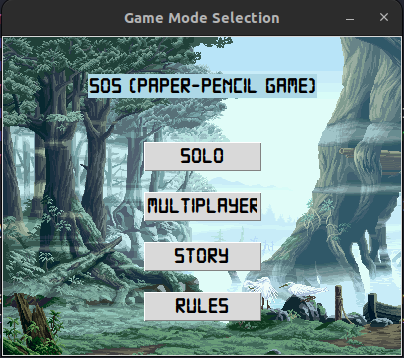

# SOS AI Game


[](https://github.com/Sk-Azraf-Sami/SOS-Paper-Pencil-Game-AI/graphs/contributors)
[](https://github.com/Sk-Azraf-Sami/SOS-Paper-Pencil-Game-AI/commits/main)
[](https://github.com/Sk-Azraf-Sami/SOS-Paper-Pencil-Game-AI/search?l=python&type=Code)


## Table of Contents 
- [Description](#description)
- [User Interface](#user-interface)
- [Installation](#installation)
- [How to Run](#how-to-run)
- [How to Play](#how-to-play)
- [Documentation](#documentation)
- [Contributing](#contributing)
- [License](#license)


## [Description](#description)

SOS is a traditional paper-pencil game where players take turns writing either an 'S' or an 'O' on a grid to form the word "SOS" horizontally, vertically, or diagonally. This AI-based SOS game enhances the original game with artificial intelligence algorithms to provide different levels of difficulty:

- **Easy**: Uses Fuzzy Logic to make AI decisions.
- **Medium**: Leverages a Genetic Algorithm to simulate intelligent moves.
- **Hard**: Utilizes the A* (A-star) search algorithm for optimal pathfinding strategies.
- **Very Hard**: Implements Minimax with Alpha-Beta Pruning for competitive gameplay in AI vs. Human mode.

The game also supports **AI vs. Human** and **Human vs. Human** play modes.

## [User Interface](#user-interface)

|   <br> **Figure 1: Home Menu** |   <br> **Figure 2: Mode Selection** |
|:-------------------------------------------------------:|:---------------------------------------------------------------:|
|   <br> **Figure 3: Game Story** |   <br> **Figure 4: Rules**                   |
|   <br> **Figure 5: Player's Name** |   <br> **Figure 6: Multiplayer Board** |
|   <br> **Figure 7: Interaction on Multiplayer Board** |   <br> **Figure 8: Easy Mode using Fuzzy Logic** |
|   <br> **Figure 9: Medium Mode using Genetic Algorithm** |   <br> **Figure 10: Hard Mode using A*** |
|   <br> **Figure 11: Very Hard Mode using Min-Max** |   <br> **Figure 12: Result Window Box** |

## [Installation](#installation)

To install the SOS AI Game, follow these steps:

1. **Clone the repository:**
    ```bash
    git clone https://github.com/Sk-Azraf-Sami/SOS-Paper-Pencil-Game-AI.git
    cd SOS-Paper-Pencil-Game-AI
    ```

2. **Install the required dependencies:**
    Make sure you have `pip` installed and then run:
    ```bash
    pip install -r requirements.txt
    ```

3. **Ensure you have Python installed:**
    The game was developed using Python 3.x. You can download the latest version from [python.org](https://www.python.org/downloads/). After installation, verify that Python is installed correctly by running:
    ```bash
    python --version
    ```
    or, for some systems:
    ```bash
    python3 --version
    ```

4. **Install Tkinter (if necessary):**
    Tkinter is included with the standard Python installation on most systems. You can test if it's installed by running:
    ```python
    import tkinter
    tkinter._test()
    ```
    If a small window appears, Tkinter is installed correctly. If you are using Linux and Tkinter is not available, you may need to install it manually:
    - **Ubuntu/Debian:**
      ```bash
      sudo apt-get install python3-tk
      ```
    - **Fedora:**
      ```bash
      sudo dnf install python3-tkinter
      ```
    - **Arch Linux:**
      ```bash
      sudo pacman -S python
      ```


## [How to Run](#how-to-run)

To start the game, run the following command: 
```bash
python menu.py
```
#### Additional Notes
- If you encounter any issues during installation, please check the repository's [issues section](https://github.com/Sk-Azraf-Sami/SOS-Paper-Pencil-Game-AI/issues) for solutions or to report a problem.
- Be sure to check for updates regularly to keep the game running smoothly.


## [How to Play](#how-to-play)

<p align="center">
  <a href="https://github.com/user-attachments/assets/6eda2253-d627-4895-82ce-a9bf734f5d2b">
    
  </a>
</p>


## [Documentation](#documentation)

For detailed information about the 'SOS-Paper-Pencil AI Game', please refer to the [docummentation](https://github.com/Sk-Azraf-Sami/SOS-Paper-Pencil-Game-AI/blob/main/sos-documentation.pdf).


## [Contributing](#contributing)

Thank you for your interest in contributing to the 'SOS-Paper-Pencil AI Game'! We welcome contributions from everyone. To get started, please follow the guidelines below:

##### Bug Reports and Feature Requests

If you encounter any bugs or have ideas for new features, please open an issue on the GitHub repository. When opening an issue, provide as much detail as possible, including steps to reproduce the issue and any relevant information about your environment. This will help us investigate and address the problem more effectively.

##### Pull Requests

We gladly accept pull requests for bug fixes, enhancements, and new features. To contribute code to the project, follow these steps:

1. Fork the repository and create your branch from the `main` branch.
2. Make your changes, ensuring that your code adheres to the project's coding style and conventions.
3. Write tests to cover your changes and ensure the existing tests pass.
4. Ensure your code compiles without any errors or warnings.
5. Commit your changes and push your branch to your forked repository.
6. Open a pull request against the `main` branch of the original repository.
7. Provide a clear and descriptive title for your pull request and explain the changes you have made.
8. Be responsive to any feedback or questions during the review process.

By contributing to this project, you agree that your contributions will be licensed under the project's [MIT License](https://opensource.org/licenses/MIT).

##### Code Style and Conventions

To maintain consistency throughout the project's codebase, please adhere to the following guidelines:

- Use proper indentation and formatting.
- Follow naming conventions for variables, classes, and methods.
- Write clear and concise comments to improve code readability.
- Ensure your code is modular, reusable, and follows best practices.

##### Communication

If you have any questions or need assistance, feel free to reach out to the project maintainers or open an issue on GitHub.

We appreciate your contributions and look forward to working with you to improve this game!


## [License](#license)

This project is licensed under the [MIT License](https://opensource.org/licenses/MIT).
